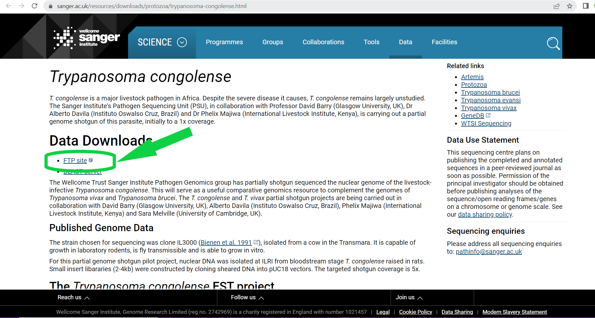
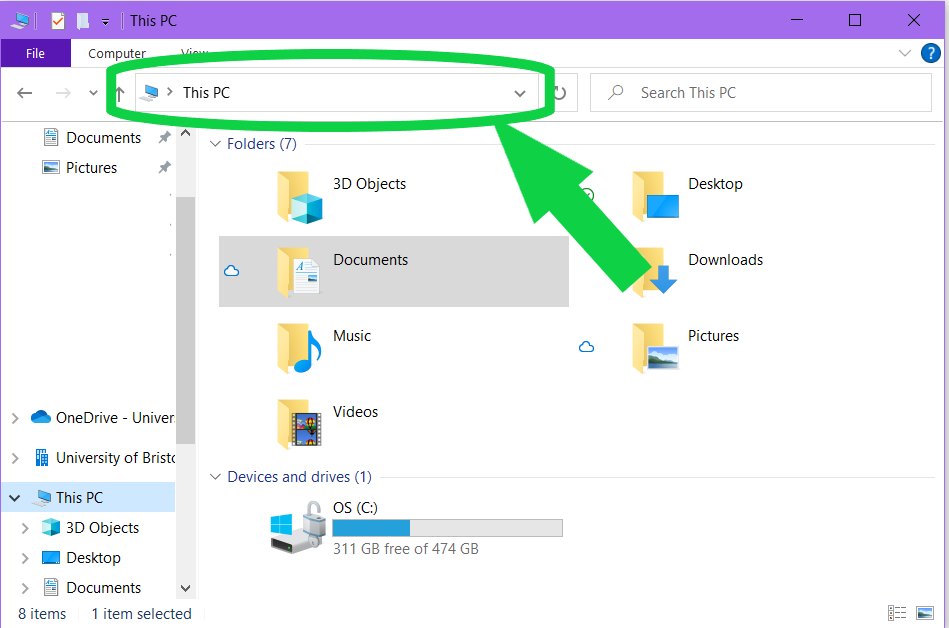
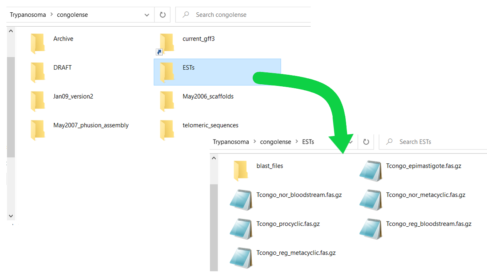
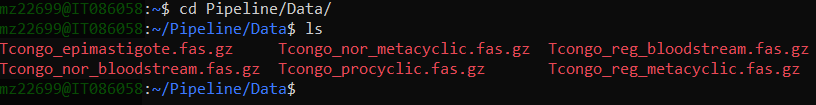
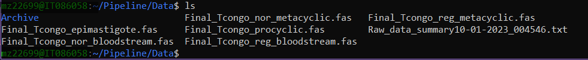
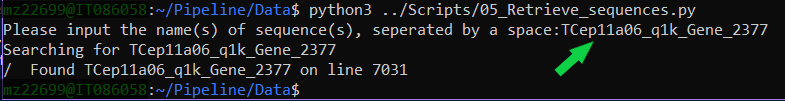
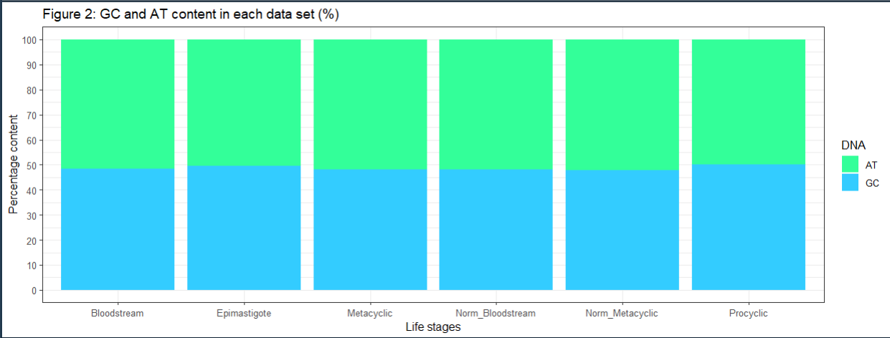

Pipeline for the analysis of *Trypanosoma congolense* ESTs - Manual and
Report
================
Glen Roarke (2228202), Katie Stoker (2330194) and Aidan Pugh (2316131)
2022-11-29

# Introduction

*Trypanosoma congolense* is a parasite found in African livestock and
causes Nagana disease. This leads to anemia, weight-loss and
immunosuppression in cattle (Helm *et al*., 2009) and can be fatal.
Nagana disease leads to large economic losses, and so understanding more
about *T.congolense* will help to reduce this.

This pipeline is designed for expressed sequence tag (ESTs) data,
produced from cDNA libraries synthesized from messenger RNA in cells. By
sequencing cDNA to get ESTs, you are able to take a snapshot of which
genes were being expressed at that moment. The specific data is from the
Helm (2009) paper, where 6 cDNA libraries were produced total. 4 of the
libraries contained *T.congolense*-specific ESTs for each life stage of
the parasite: procyclic (PCF), epimastigote (EMF) and metacyclic (MCF)
forms found in the insect host, and the bloodstream form (BSF) found in
mammal blood. There are also 2 normalized cDNA libraries for MCF and BSF
ESTs which allow you to look at the less abundant sequences in the
transcriptome.

We have created a user friendly pipeline using bash and python, that
will run in Ubuntu. The user will need to have a basic understanding of
how to navigate through directories and run scripts. That said, this
manual gives step-by-step instructions on how to run the pipeline. There
will be methods to prevent overwriting of files and the original data
will be archived. All files will be clearly named, and specific output
files will be mentioned throughout this manual.

## Before you get started…

<details>
<summary>
**TransDecoder Background**
</summary>

- In order to extract ORFs from the EST data, TransDecoder.LongOrfs is
  used.

- Only ORFs which are at least 100 amino acids long are identified by
  TransDecoder.LongOrfs.

- The output of TransDecoder is a file containing peptide sequences.

</details>
<details>
<summary>
**Useful Ubuntu commands**
</summary>

- `cd` is used to move to the directory specified.

- `bash` is used to run shell scripts.

- `python3` is used to run python scripts.

- `ls` is used to list the contents of your current directory.

</details>
<details>
<summary>
**System requirements**
</summary>

- This pipeline has been created and executed on a Windows OS.

- Ubuntu must be installed.

</details>
<details>
<summary>
**Software requirements**
</summary>

The following need to be installed - don’t worry, we will give
instructions!

- TransDecoder_v5.5.0
  \[<https://github.com/TransDecoder/TransDecoder/releases>\]

- Python

- Biopython

</details>

# The Pipeline

## Installations

### TransDecoder

Open your Ubuntu terminal and type:

``` r
# Install TransDecoder

sudo apt-get install transdecoder
```

``` r
# Installations will occur, then you are asked:

After this operation, XXX MB of additional disk space will be used.
Do you want to continue? [Y/n]
```

Type `y` and press enter. Ubuntu will continue to install TransDecoder.

``` r
# Make sure TransDecoder is updated to the latest version

sudo apt-get update
```

<span style="color: green;"> **TransDecoder has now been installed!**
</span>

### Python

``` r
# Check that you have python version 3 in your Ubuntu terminal

python3 --version
```

If Ubuntu prints `Python 3.X.X`, you should be good to go. If not, we
recommend re-installing Ubuntu to a later version.

<span style="color: green;"> **Python is up-to-date!** </span>

### Biopython

``` r
# Install Biopython in your Ubuntu terminal

pip install biopython
```

``` r
# Check that the latest version is updated

pip install biopython --upgrade
```

<span style="color: green;"> **Biopython has now been installed!**
</span>

### Troubleshoting

If these installs cause you problems, we recommend repeating steps that
involve updating the software - the beauty of code is that it is
constantly being added to and streamlined, but this can cause problems
if you are not working with the latest versions.

## Setting up the pipeline

The pipeline folder contains everything you will need to run the
pipeline, with the exception of the data. Navigate to your Ubuntu folder
and paste the whole Pipeline folder into Ubuntu. The contents of the
pipeline folder include: \* A folder called “Scripts”, containing 6
scripts (numbered 00-05)

- A READ_ME.txt file

- An empty folder called “Data”

<span style="color: green;"> **The pipeline is now ready to go!**
</span>

## Get data

- The ESTs are stored in an online FTP location, accessed through this
  link:
  <https://www.sanger.ac.uk/resources/downloads/protozoa/trypanosoma-congolense.html>

- Right click the link highlighted in the image below and copy.

<!-- -->

- Open the windows file explorer and paste the link into the address bar
  at the top

<!-- -->

- Once you have connected to the FTP server, click on the folder called
  **ESTs**, and inside you will find the data. Copy all the files ending
  in .fas.gz into the Pipeline folder named “Data” in your Ubuntu.

<!-- -->

If you want to run the Pipeline on another set of data, we recommend
creating a new directory with a different name to sit alongside the
existing “Data” folder in the Pipeline directory.

<span style="color: green;"> **Now your pipeline has data!** </span>

# Running the pipeline

Each script will have its own section, and it is important that <span
style="color: red;">**every script must be run whilst you are in the
“Data” directory** </span>

## `00_Unzip_file.sh`

<!-- -->

- If the files are red, this means they are zipped. `00_Unzip_file.sh`
  unzips these files.

- If they are already unzipped, skip this step.

``` r
bash ../Scripts/00_Unzip_file.sh
```

- Type `ls` and press enter. You will see that your files end in .fas,
  as they are unzipped.

**Details**

The syntax shown above is used every time a script is run, meaning you
won’t have to move directories to run different scripts. It is important
to note that:

1.  Using `bash ../Scripts/`, we told Ubuntu to run a script from a
    different folder to the one we are currently in.

2.  The scripts are numbered, so that using tab to auto-complete the
    script is easy.

This specific script is numbered 00 as it may not be needed if the
folders are already unzipped.

## `01_Raw_data_summary.sh`

``` r
bash ../Scripts/ 01_Raw_data_summary.sh
```

- A file called <span style="color: purple;">.Raw_data_summary\[
  *current date* \].txt </span> is produced.

**Details**

- The output has a unique time-stamped name, and so will not be
  overwritten if you run the pipeline multiple times. This file
  includes:

- The number of sequences in each EST data set

- The number of sequences containing dash (-) characters. Dash
  characters are important to identify, as TransDecoder does not
  understand dashes.

## `02_Clean_files.sh`

``` r
bash ../Scripts/02_Clean_files.sh
```

Files beginning with “Final”, and a folder called “Archive” have been
produced. “Final\_\[ *data name *\]” is what is used by TransDecoder.

<!-- -->

**Details**

- The files starting “Final” are the same as the original files, but
  dash characters have been replaced with “N”, allowing TransDecoder to
  read the missing nucleotides, and not remove dash characters which
  would cause a frame shift.

- “Archive” is a folder containing the original raw data - if you need
  to retrieve it again, it is stored safely in the is directory.

## `03_TransDecoder.sh`

``` r
bash ../Scripts/03_TransDecoder.sh
```

- TransDecoder has now converted the data set into peptide sequences,
  whilst selecting amino acid lengths greater than 100, and in the most
  likely reading frame.

**Details**

- This script is capable of looping through any files which have been
  checked for dash characters

- As TransDecoder is a long process, running `03_TransDecoder.sh` once
  will automatically run through them all, so you don’t have to run it
  multiple times.

- Once TransDecoder has finished running, many new files will have been
  produced, which can seem overwhelming. The files of interest end with
  <span style="color: purple;"> .fas.transdecoder.pep </span>

- Many files are used by TransDecoder and are not of interest to us, but
  some files are informative:

<!-- -->

## `04_Rename_sequences.py`

- This time, we will be using `python3` to run the script.

``` r
python3 ../Scripts/04_Rename_sequences.py
```

**Details**

- This script renames all sequences to unique codes, in all .pep
  outputs. These sequences are based off the original names found in the
  raw data.

- The files gain the prefix “Renamed”, so it is easy to find which files
  are renamed. <!-- -->

## `05_Retrieve_sequences.py`

``` r
python3 ../Scripts/05_Retrieve_sequences.py
```

- After pressing enter, the terminal prints the following:

``` r
Creating file of all peptides
Please input the name(s) of sequence(s), seperated by a space:
```

- Input the ID of sequences you are interested in. If you don’t have any
  ready, try these examples below.

``` r
# TCep11a06_q1k_Gene_2377 TCep11d12_q1k_Gene_2425 TCep11e09_q1k_Gene_2435 NONAME_q1k_Gene_1234 TCbl10c06_p1k_Gene_3001 TCmcn10d06_p1k_Gene_1050
```

- Alternatively, type any non-sequence word and press enter to cancel
  the retrieval.

<!-- -->

- The green arrow shows an example input. The script searches for that
  input, and then prints whether or not it was found.

- The output file is <span style="color: purple;"> RETRIEVED_SEQS.fas
  </span>.

<!-- -->

**Details**

- The file <span style="color: purple;"> RETRIEVED_SEQS.fas </span> will
  not be overwritten - instead, everytime `05_Retrieve_sequences.py` is
  run, the sequences are added to this file.

- To start a new collection of sequences, you need to remove or rename
  <span style="color: purple;"> RETRIEVED_SEQS.fas </span> to something
  else.

- This allows the user to take any sequence from any data set, rather
  than be limited to one data set at a time.

- The script can be run many times, after `04_Rename_sequences.py` has
  been run.

# The Report

## Analysis of results

Analysis of the TransDecoder output is important for deriving
information about both the nucleotide and peptide sequences, and can
reveal biological evidence of function, structure and activity of the
proteins. From the *T.congolense* EST datasets, understanding the
function and activity of proteins in each life-cycle stage might suggest
new findings on the life-cycle mechanism, and identify areas which could
be targeted for disease prevention.

Peptide sequence length was first analysed for each life-cycle stage
(Figure 1). The graph shows that there is a right skew in the data,
where there is a greater proportion of short length peptides and lower
proportion of long length peptides in each life-cycle stage. While it
could be hypothesised that the presence of shorter peptides indicate
that the life-cycle stage involves proteins which are similar in
structure and function, it is difficult to derive any conclusions from
this initial analysis. This is because the ESTs were from mRNA which is
often highly fragmented as it does not exist in cells for a long period
of time, due to the degradation pathways such as deadenylation (Chen et
al., 2010).

<!-- --><!-- --><!-- --><!-- --><!-- --><!-- -->

**Fig.1: Distributions of peptide sequence lengths** <br> <br> Isochore
content was then analysed for each life-cycle stage to study whether
there are any guanine (G)-cytosine (C) rich regions in each life-cycle
stage (Figure 2). In particular greater G-C content ensures greater
thermal stability (Hu et al., 2022). It is therefore interesting to
investigate whether G-C content is different between life-cycle stages,
where environmental conditions may be most drastically altered upon
entering the bloodstream stage, as mammal blood is much warmer than the
insect host environment. However, the results of G-C content suggests
that there is no observable difference between life-cycle stages for the
ESTs collected.

<!-- -->

**Fig.2: DNA nucleotides percentage content in each data set.**

## Future Directions

**BLASTp**

`05_Retrieve_sequences.py` script allows you to create a fasta file with
sequences of interest, which is compatible with BLASTp. An example below
shows the sequence with ID *TCep_01a11_q1k_Gene_98*, which contains a
start and stop amino acid.

BLASTp \[<https://blast.ncbi.nlm.nih.gov/Blast.cgi>\] is a method to
search for protein homology, as shown below.

Protein BLAST can be used to query the output peptide sequences against
a sequence database to compare sequences, identify regions of similarity
and study the statistical significance of such similarity. In turn, this
information could be useful for studying whether the output peptides,
and resulting proteins, have similar biological function and activity to
those with high similarity (Rehm, 2001).

<!-- --> <br> <br> **Pfam**

An additional analysis could be to investigate whether there are any
amino acids which are more abundantly expressed in the peptide sequences
of each life-cycle stage. The presence of amino acid abundance biases
may indicate that the proteins contain particular domains, and
potentially identify function. To investigate this further, the protein
families database (Pfam) can be used to study protein functions by
classifying protein sequences by domain or family (Mistry et al., 2021).
In combination, study of domain interactions may provide further insight
into the role of the protein in each life-cycle stage, and possibility
the mechanism of action by identifying protein interactions in the
pathway.

<!-- -->

## Conclusion

Our pipeline is a user-friendly method for cleaning ESTs, converting
them into protein sequences, renaming them to a readable format and
finally aiding in the retrieval of sequences based on a unique ID. The
outputs of this pipeline are all in a fasta format, which allows the
data to be compatible with resources such as BLASTp and Pfam to help
with more extensive analysis.

Being able to use resources such as BLASTp may help us to identify which
proteins are more common in different life stages, and what the purpose
of the protein is. This could allow us to target these proteins, for
example, by blocking the protein receptors or active sites to prevent
them from releasing damaging proteins in their hosts, especially
mammals.

## Acknowedgements

All three of us (Glen Roarke-2228202, Katie Stoker-2330194 and Aidan
Pugh-2316131) have worked collaboratively on all aspects of the project.

## References

- Chen, C.-Y.A. and Shyu, A.-B. (2010). Mechanisms of
  deadenylation-dependent decay. *Wiley Interdisciplinary Reviews: RNA*,
  \[online\] 2(2), pp.167–183. <doi:10.1002/wrna.40>.

- Helm, J., Hertz-Fowler, C., Aslett, M., Berriman, M., Sanders, M.,
  Quail, M., Soares, M., Bonaldo, M., Sakurai, T., Inoue, N. and
  Donelson, J. (2009). Analysis of expressed sequence tags from the four
  main developmental stages of *Trypanosoma congolense*. *Molecular &
  Biochemical Parasitology*, 168(1), pp.34–42.

- Hu, E.-Z., Lan, X.-R., Liu, Z.-L., Gao, J. and Niu, D.-K. (2022). A
  positive correlation between GC content and growth temperature in
  prokaryotes. *BMC genomics*, \[online\] 23(1), p.110.
  <doi:10.1186/s12864-022-08353-7>.

- Mistry, J., Chuguransky, S., Williams, L., Qureshi, M., Salazar,
  Gustavo A., Sonnhammer, E. L. L., Tosatto, S. C. E., Paladin, L., Raj,
  S., Richardson, L. J., Finn, R. D. and Bateman, A. (2021) ‘Pfam: The
  protein families database in 2021’, *Nucleic Acids Research*, 49(D1),
  pp. D412-D419.

- Rehm, B. (2001) ‘Bioinformatic tools for DNA/protein sequence
  analysis, functional assignment of genes and protein classification’,
  *Applied Microbiology and Biotechnology*, 57(5), pp. 579-592.
