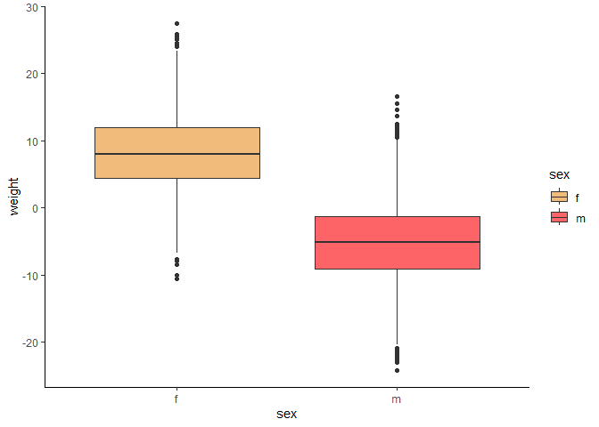
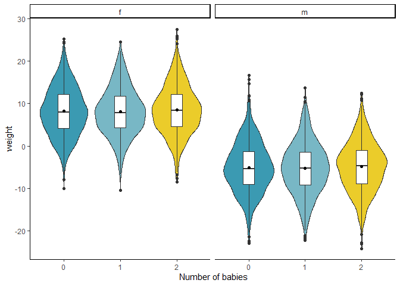
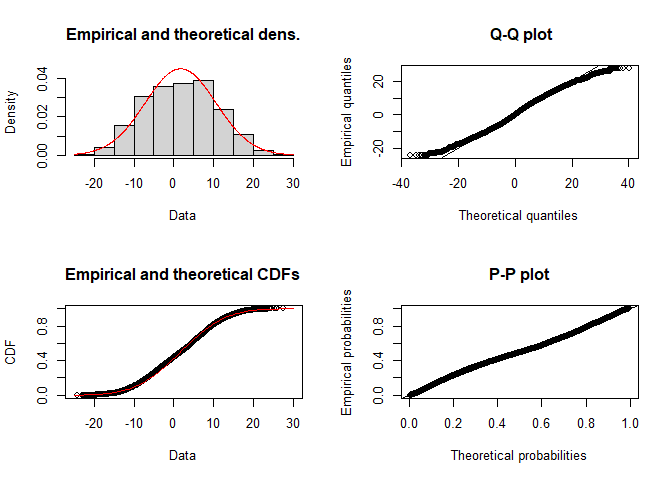
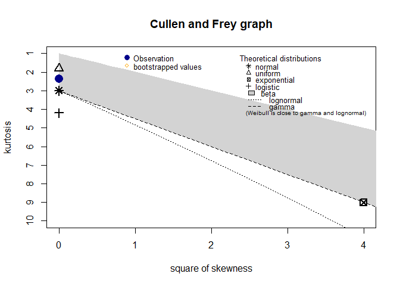
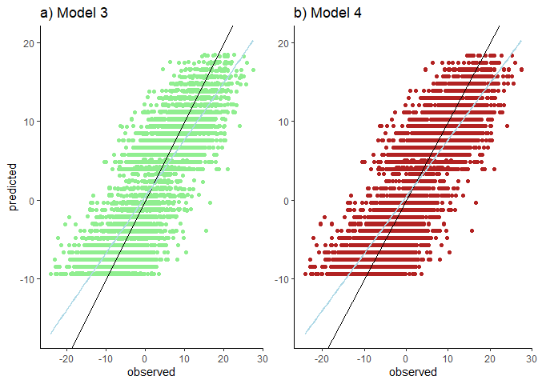
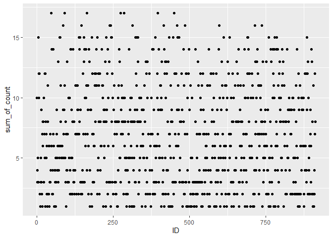
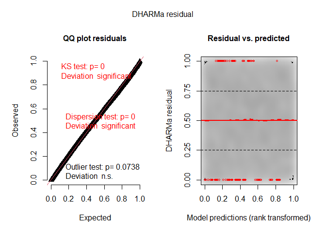
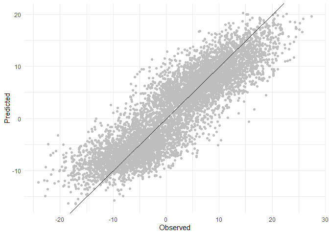

R programming coursework
================
2228202
2022-11-28

# Install

``` r
install.packages("tidyverse")
install.packages("ggplot2")
install.packages("rstatix")
install.packages("ggpubr")
install.packages("knitr")
install.packages("performance")
install.packages("interactions")
install.packages("jtools")
install.packages("wesanderson")
install.packages("vroom")
install.packages("gridExtra")
install.packages("ggh4x")
install.packages('fitdistrplus')
install.packages("glmmTMB")
install.packages("MuMIn")
install.packages("DHARMa")
```

## Load

``` r
knitr::opts_chunk$set(echo = TRUE)

library("tidyverse")
library("ggplot2")
library("rstatix")
library("ggpubr")
library("knitr")
library("performance")
library("interactions")
library("jtools")
library("wesanderson")
library("vroom")
library("gridExtra")
library("ggh4x")
library('fitdistrplus')
library("glmmTMB")
library("MuMIn")
library("DHARMa")
```

# Introduction

Investigate if summer NAO (sNAO) has an effect on body mass of *Ovis
aries* and determine other factors.

## Hypothesis

- Null - The sNAO has no effect on body mass within the population.
- Alternative - NAO and sNAO determines weight within the population.

# Exploratory Data Analysis

## Import

``` r
#Vroom package to load data.

#sets wd to location of rmd file R studio only not console
#setwd(dirname(rstudioapi::getActiveDocumentContext()$path))


# load in zipped gz files
mass_data <- vroom("../Data/mass_fh22528.tsv.gz")
```

    ## Rows: 7000 Columns: 8
    ## ── Column specification ────────────────────────────────────────────────────────
    ## Delimiter: "\t"
    ## chr (1): sex
    ## dbl (7): ID, age, n_babies, site, year, pop_size, weight
    ## 
    ## ℹ Use `spec()` to retrieve the full column specification for this data.
    ## ℹ Specify the column types or set `show_col_types = FALSE` to quiet this message.

``` r
nao_data <- vroom("../Data/NAO_fh22528.tsv.gz")
```

    ## Rows: 492 Columns: 3
    ## ── Column specification ────────────────────────────────────────────────────────
    ## Delimiter: "\t"
    ## chr (1): month
    ## dbl (2): year, NAO
    ## 
    ## ℹ Use `spec()` to retrieve the full column specification for this data.
    ## ℹ Specify the column types or set `show_col_types = FALSE` to quiet this message.

## Data Structure

``` r
#kable function presents in a table.
knitr::kable(head(mass_data))
```

|  ID | age | sex | n_babies | site | year | pop_size |     weight |
|----:|----:|:----|---------:|-----:|-----:|---------:|-----------:|
|   9 |   0 | m   |        1 |    2 | 1980 |      142 |  -8.457970 |
| 107 |   0 | m   |        1 |    2 | 1980 |      142 |  -3.242283 |
| 111 |   0 | m   |        2 |    2 | 1980 |      142 |  -8.800941 |
| 156 |   0 | f   |        0 |    1 | 1980 |      142 |   5.439987 |
| 217 |   0 | m   |        1 |    1 | 1980 |      142 | -11.548408 |
| 277 |   0 | m   |        0 |    1 | 1980 |      142 |         NA |

``` r
knitr::kable(head(nao_data))
```

| year | month    |        NAO |
|-----:|:---------|-----------:|
| 1980 | January  |  1.1580276 |
| 1980 | February |  0.9223638 |
| 1980 | March    |  1.0678656 |
| 1980 | April    |  1.0092662 |
| 1980 | May      |  0.8724799 |
| 1980 | June     | -1.4810281 |

``` r
# view the data types 
dplyr::glimpse(mass_data)
```

    ## Rows: 7,000
    ## Columns: 8
    ## $ ID       <dbl> 9, 107, 111, 156, 217, 277, 356, 422, 518, 529, 531, 547, 685…
    ## $ age      <dbl> 0, 0, 0, 0, 0, 0, 0, 0, 0, 0, 0, 0, 0, 0, 0, 0, 0, 0, 0, 1, 0…
    ## $ sex      <chr> "m", "m", "m", "f", "m", "m", "f", "m", "f", "f", "f", "f", "…
    ## $ n_babies <dbl> 1, 1, 2, 0, 1, 0, 1, 1, 1, 1, 1, 2, 2, 2, 2, 2, 0, 1, 1, 0, 0…
    ## $ site     <dbl> 2, 2, 2, 1, 1, 1, 2, 2, 1, 1, 1, 2, 3, 1, 2, 3, 2, 3, 2, 2, 3…
    ## $ year     <dbl> 1980, 1980, 1980, 1980, 1980, 1980, 1980, 1980, 1980, 1980, 1…
    ## $ pop_size <dbl> 142, 142, 142, 142, 142, 142, 142, 142, 142, 142, 142, 142, 1…
    ## $ weight   <dbl> -8.4579701, -3.2422833, -8.8009407, 5.4399872, -11.5484079, N…

``` r
dplyr::glimpse(nao_data)
```

    ## Rows: 492
    ## Columns: 3
    ## $ year  <dbl> 1980, 1980, 1980, 1980, 1980, 1980, 1980, 1980, 1980, 1980, 1980…
    ## $ month <chr> "January", "February", "March", "April", "May", "June", "July", …
    ## $ NAO   <dbl> 1.1580276, 0.9223638, 1.0678656, 1.0092662, 0.8724799, -1.481028…

### mass_data

- response variable - weight (kgs) - data has been normalised.

- predictor variables

  - Sex
  - NAO
  - Age

### nao_data

- Response variable - NAO
  - negative (low) and positive (high).
- predictor variable
  - year
  - month

## Visualisations

``` r
# Group NAO by year 
grouped_NAO <- nao_data %>% 
  group_by(year) %>% 
  summarise(mean_NAO = mean(NAO))

ggplot(grouped_NAO, aes(y = mean_NAO, x = year )) +
  geom_line(col = "lightgrey") +
  geom_point(col = "darkorchid3") +
  theme_classic() +
  ylab("difference in mean NAO (hPa)") +
  ggtitle("Yearly NAO difference")
```

<!-- -->
**Figure 1.** Yearly mean NAO difference - The figure, indicates that
there is a clear positive relationship between NAO and year.There is a
high level of fluctuation indicated by the peaks and troughs.

``` r
ggplot(nao_data, aes(y = NAO, x = year, col = month)) +
  geom_point() +
  theme_classic() +
  ggtitle("Yearly NAO difference by month")
```

<!-- -->

**Figure 2.** Yearly NAO difference by month There is a clear pattern of
NAO pressure being much more variable in June, July and august.

``` r
#analysis of NAO data points by month

#converts month character so it can be ordered.
nao_data$month = factor(nao_data$month,levels = month.name)

# NAO difference by month - boxplot and   jitter
ggplot(nao_data, aes(y = NAO, 
                     x = factor(nao_data$month,levels = month.name), fill = month)) +
  geom_boxplot(alpha = 0.3, outlier.shape=NA) +
  geom_point(position=position_jitterdodge()) +
  theme_classic() +
  ylab("difference NAO (hPa)") +
  xlab("Month") +
  theme(axis.text.x=element_blank(),
        axis.ticks.x=element_blank(),
        ) +
  ggtitle("Monthly NAO difference")
```

<!-- -->

**Figure 3.** Monthly NAO difference - This shows that NAO has much more
variation within the months of June-August.

## Mass data analysis

### Check NAs

``` r
#check for NA values and present results in a table

knitr::kable(mass_data %>%
  dplyr::select(everything()) %>%  #select all columns
  summarise_all(funs(sum(is.na(.)),n = n())) %>% #apply to all columns
  dplyr::select(c(1:9))) # only show 1 sample total
```

| ID_sum | age_sum | sex_sum | n_babies_sum | site_sum | year_sum | pop_size_sum | weight_sum | ID_n |
|-------:|--------:|--------:|-------------:|---------:|---------:|-------------:|-----------:|-----:|
|      0 |       0 |       0 |            0 |        0 |        0 |            0 |        667 | 7000 |

``` r
knitr::kable(nao_data %>%
  dplyr::select(everything()) %>%  #select all columns
  summarise_all(funs(sum(is.na(.)),n = n())) %>% #apply to all columns
   dplyr::select(c(1:4)))# only show 1 sample total
```

| year_sum | month_sum | NAO_sum | year_n |
|---------:|----------:|--------:|-------:|
|        0 |         0 |       0 |    492 |

``` r
#remove_NAs
mass_data_clean <- mass_data %>% 
  dplyr::filter(!is.na(weight))  #remove NAs
```

``` r
# check for normal distribution of data of our response variable
ggplot(mass_data_clean, aes(x = weight, alpha=after_stat(count))) + 
  geom_histogram(fill = "darkolivegreen4", binwidth = 1) +
  theme_classic() +
  theme(legend.position = "none")
```

<!-- -->

**Figure 4.** Distribution of weight difference - This figure shows how
weight difference has a central tendency towards 1kg.

``` r
ggqqplot(mass_data_clean, x = "weight", color = "dodgerblue4") + theme_classic()
```

<!-- -->

**Figure 5.** Weight qqplot - At the extreme ends weight data does not
fit very well to a normal distribution, it is lightly tailed.

``` r
#weight and sex
ggplot(mass_data_clean, aes(x= sex, y = weight, fill = sex)) + 
  geom_boxplot() + theme_classic() +
  scale_fill_manual(values = wes_palette("GrandBudapest1"))+
  scale_color_manual(values = wes_palette("GrandBudapest1"))
```

<!-- -->

**Figure 7. ** Sex and weight difference - The difference in mean weight
between the male and female groups.

``` r
#weight, n_babies, facet by sex
ggplot(mass_data_clean, aes(x = as.factor(n_babies), y = weight, fill = as.factor(n_babies))) + 
  geom_violin() +
  geom_boxplot(width=0.2, fill = "white") +
  facet_grid(~ sex) +
  theme_classic() +
  scale_fill_manual(values = wes_palette("Zissou1"))+
  scale_color_manual(values = wes_palette("Zissou1")) +
  xlab(" Number of babies") +
  stat_summary( fun = mean, geom="point") +
  theme(legend.position="none")
```

<!-- -->

**Figure 8. ** Number of babies and weight difference - The number of
babies does not influence a difference in weight.

``` r
#weight, age and year
ggplot(mass_data_clean, aes(x= year, y = weight, col = age)) + 
  geom_point() + theme_classic()
```

<!-- -->

``` r
  #scale_fill_manual(values = wes_palette("GrandBudapest1"))+
  #scale_color_manual(values = wes_palette("GrandBudapest1"))
```

Figure 9 - Weight by Year and Age The plot shows that older sheep
generally have higher weight.

``` r
ggplot(mass_data_clean, aes(x= sex, y = age)) + 
  geom_boxplot() + theme_classic()
```

<!-- -->

``` r
#weight, age 
ggplot(mass_data_clean, aes(x= age, y = weight, col = age)) + 
  geom_point() + theme_classic()
```

<!-- -->

- **Summary** - Sex , age and year are interesting variables.

# Data transformation

The mass data needs to be joined to the NAO data by the year column.

``` r
# Join yearly mass to yearly NAO data.
mass_NAO_df <- dplyr::left_join(mass_data_clean, nao_data,
                                     by = c("year"= "year"))
```

    ## Warning in dplyr::left_join(mass_data_clean, nao_data, by = c(year = "year")): Detected an unexpected many-to-many relationship between `x` and `y`.
    ## ℹ Row 1 of `x` matches multiple rows in `y`.
    ## ℹ Row 1 of `y` matches multiple rows in `x`.
    ## ℹ If a many-to-many relationship is expected, set `relationship =
    ##   "many-to-many"` to silence this warning.

``` r
#view the transformation
knitr::kable(head(mass_NAO_df))
```

|  ID | age | sex | n_babies | site | year | pop_size |   weight | month    |        NAO |
|----:|----:|:----|---------:|-----:|-----:|---------:|---------:|:---------|-----------:|
|   9 |   0 | m   |        1 |    2 | 1980 |      142 | -8.45797 | January  |  1.1580276 |
|   9 |   0 | m   |        1 |    2 | 1980 |      142 | -8.45797 | February |  0.9223638 |
|   9 |   0 | m   |        1 |    2 | 1980 |      142 | -8.45797 | March    |  1.0678656 |
|   9 |   0 | m   |        1 |    2 | 1980 |      142 | -8.45797 | April    |  1.0092662 |
|   9 |   0 | m   |        1 |    2 | 1980 |      142 | -8.45797 | May      |  0.8724799 |
|   9 |   0 | m   |        1 |    2 | 1980 |      142 | -8.45797 | June     | -1.4810281 |

``` r
#### lets try to create a summer categorical variable to group by ###
## 28/12/2022

#filter for the summer months with increased NAO variation
summer_filter <- c("June", "July", "August")

### creating a category of sNAO and not sNAO for visualisaton
mass_NAO_df <- mass_NAO_df %>%
  mutate(nao_type = case_when(month %in% summer_filter ~ "summer_NAO", #in summer
                              !month %in% summer_filter ~ "not_summer_NAO"))#not in summer

knitr::kable(head(mass_NAO_df))
```

|  ID | age | sex | n_babies | site | year | pop_size |   weight | month    |        NAO | nao_type       |
|----:|----:|:----|---------:|-----:|-----:|---------:|---------:|:---------|-----------:|:---------------|
|   9 |   0 | m   |        1 |    2 | 1980 |      142 | -8.45797 | January  |  1.1580276 | not_summer_NAO |
|   9 |   0 | m   |        1 |    2 | 1980 |      142 | -8.45797 | February |  0.9223638 | not_summer_NAO |
|   9 |   0 | m   |        1 |    2 | 1980 |      142 | -8.45797 | March    |  1.0678656 | not_summer_NAO |
|   9 |   0 | m   |        1 |    2 | 1980 |      142 | -8.45797 | April    |  1.0092662 | not_summer_NAO |
|   9 |   0 | m   |        1 |    2 | 1980 |      142 | -8.45797 | May      |  0.8724799 | not_summer_NAO |
|   9 |   0 | m   |        1 |    2 | 1980 |      142 | -8.45797 | June     | -1.4810281 | summer_NAO     |

## Data Visualisation

Data visualation after the join.

``` r
#point data
ggplot(data = mass_NAO_df, 
       aes(x = NAO , y = weight, colour = nao_type )) + 
  geom_point() + theme_classic()
```

<!-- -->

**Figure 10 ** weight by summer NAO A view of the data after joining
Mass and NAO data via year show clustering of non-summer months.

# Generalised linear models (GLMs)

Examine casual relationships using GLMs.

- Variables of interest.
  - sex
  - NAO
  - year
  - age
  - month

## Deciding distributions

``` r
#check oberserved weigth differences, against the normal distribution.
plot(fitdist(mass_NAO_df$weight, "norm"))
```

<!-- -->

``` r
#summary statistics, skewness is low.
descdist(mass_NAO_df$weight, boot = 1000)
```

<!-- -->

    ## summary statistics
    ## ------
    ## min:  -24.10937   max:  27.44608 
    ## median:  1.906967 
    ## mean:  1.673528 
    ## estimated sd:  8.856876 
    ## estimated skewness:  -0.02235794 
    ## estimated kurtosis:  2.375031

**Figure 11.** Fitdist the normal distribution - The normal distribution
can be used in the model,there are negative values which limit other
families.

## Creating Models

``` r
# weight - predictors - NAO
mod1 <- glm(weight ~ NAO,
            data = mass_NAO_df,
            family = "gaussian")

# weight - predictors - NAO + sex 
mod2 <-  glm(weight ~ NAO + sex,
            data = mass_NAO_df,
            family = "gaussian")

# weight - predictors - NAO + sex 
mod3 <-  glm(weight ~ NAO + sex + age,
            data = mass_NAO_df,
            family = "gaussian") 


# weight - predictors - NAO + sex 
mod4 <-  glm(weight ~ NAO + sex + age * year,
            data = mass_NAO_df,
            family = "gaussian")


# null model for comparison
null_mod <- glm(weight ~ 1,
            data = mass_NAO_df,
            family = "gaussian")
```

## Assessing Model fit

``` r
# The performance package can compare models
compare_performance(mod1, mod2, mod3, mod4) %>% kable()
```

| Name | Model |      AIC |    AIC_wt |     AICc |   AICc_wt |      BIC |   BIC_wt |        R2 |     RMSE |    Sigma |
|:-----|:------|---------:|----------:|---------:|----------:|---------:|---------:|----------:|---------:|---------:|
| mod1 | glm   | 547192.7 | 0.0000000 | 547192.7 | 0.0000000 | 547220.5 | 0.000000 | 0.0000476 | 8.856607 | 8.856723 |
| mod2 | glm   | 483591.5 | 0.0000000 | 483591.5 | 0.0000000 | 483628.5 | 0.000000 | 0.5669821 | 5.828149 | 5.828264 |
| mod3 | glm   | 450124.5 | 0.4434149 | 450124.5 | 0.4434993 | 450170.7 | 0.999878 | 0.7212336 | 4.676252 | 4.676375 |
| mod4 | glm   | 450124.1 | 0.5565851 | 450124.1 | 0.5565007 | 450188.7 | 0.000122 | 0.7212499 | 4.676115 | 4.676300 |

``` r
compare_performance(mod1, mod2, mod3, mod4, rank = TRUE) %>% kable()
```

| Name | Model |        R2 |     RMSE |    Sigma |    AIC_wt |   AICc_wt |   BIC_wt | Performance_Score |
|:-----|:------|----------:|---------:|---------:|----------:|----------:|---------:|------------------:|
| mod3 | glm   | 0.7212336 | 4.676252 | 4.676375 | 0.4434149 | 0.4434993 | 0.999878 |         0.9322567 |
| mod4 | glm   | 0.7212499 | 4.676115 | 4.676300 | 0.5565851 | 0.5565007 | 0.000122 |         0.8333537 |
| mod2 | glm   | 0.5669821 | 5.828149 | 5.828264 | 0.0000000 | 0.0000000 | 0.000000 |         0.3724935 |
| mod1 | glm   | 0.0000476 | 8.856607 | 8.856723 | 0.0000000 | 0.0000000 | 0.000000 |         0.0000000 |

**Table 1.** - A summary of GLM model formulas and ranking. Model 3 and
4 are the best performing models.

``` r
plot(compare_performance(mod1, mod2, mod3, mod4))
```

<!-- -->

**Figure 12.** Model Ranking - A visual representation of model ranking,
while a clear lowest AIC value has been determined in model 3, model 6
shows promising interactions of nao type variable and sex.

``` r
#Checking for heteroscedasticity
check_heteroscedasticity(mod1)
```

    ## OK: Error variance appears to be homoscedastic (p = 0.906).

``` r
check_heteroscedasticity(mod2)
```

    ## Warning: Heteroscedasticity (non-constant error variance) detected (p < .001).

``` r
check_heteroscedasticity(mod3)
```

    ## Warning: Heteroscedasticity (non-constant error variance) detected (p < .001).

``` r
check_heteroscedasticity(mod4)
```

    ## Warning: Heteroscedasticity (non-constant error variance) detected (p < .001).

## Model output

``` r
summary(mod3)
```

    ## 
    ## Call:
    ## glm(formula = weight ~ NAO + sex + age, family = "gaussian", 
    ##     data = mass_NAO_df)
    ## 
    ## Coefficients:
    ##               Estimate Std. Error t value Pr(>|t|)    
    ## (Intercept)  3.996e+00  3.608e-02  110.73   <2e-16 ***
    ## NAO         -9.792e-04  1.973e-02   -0.05     0.96    
    ## sexm        -1.329e+01  3.393e-02 -391.77   <2e-16 ***
    ## age          9.002e-01  4.390e-03  205.06   <2e-16 ***
    ## ---
    ## Signif. codes:  0 '***' 0.001 '**' 0.01 '*' 0.05 '.' 0.1 ' ' 1
    ## 
    ## (Dispersion parameter for gaussian family taken to be 21.86849)
    ## 
    ##     Null deviance: 5961371  on 75995  degrees of freedom
    ## Residual deviance: 1661830  on 75992  degrees of freedom
    ## AIC: 450125
    ## 
    ## Number of Fisher Scoring iterations: 2

``` r
summary(mod4)
```

    ## 
    ## Call:
    ## glm(formula = weight ~ NAO + sex + age * year, family = "gaussian", 
    ##     data = mass_NAO_df)
    ## 
    ## Coefficients:
    ##               Estimate Std. Error  t value Pr(>|t|)    
    ## (Intercept)  1.596e+00  4.784e+00    0.334   0.7386    
    ## NAO          9.673e-04  1.981e-02    0.049   0.9610    
    ## sexm        -1.329e+01  3.393e-02 -391.735   <2e-16 ***
    ## age          2.444e+00  8.822e-01    2.771   0.0056 ** 
    ## year         1.195e-03  2.390e-03    0.500   0.6172    
    ## age:year    -7.698e-04  4.401e-04   -1.749   0.0803 .  
    ## ---
    ## Signif. codes:  0 '***' 0.001 '**' 0.01 '*' 0.05 '.' 0.1 ' ' 1
    ## 
    ## (Dispersion parameter for gaussian family taken to be 21.86778)
    ## 
    ##     Null deviance: 5961371  on 75995  degrees of freedom
    ## Residual deviance: 1661733  on 75990  degrees of freedom
    ## AIC: 450124
    ## 
    ## Number of Fisher Scoring iterations: 2

Model 3 and 4 do have significant p-values for sex and age predictor
variables.

``` r
# comparing deviance of models by order of ranking.

anova(mod1, mod2, mod3, mod4, test = "Chisq")
```

    ## Analysis of Deviance Table
    ## 
    ## Model 1: weight ~ NAO
    ## Model 2: weight ~ NAO + sex
    ## Model 3: weight ~ NAO + sex + age
    ## Model 4: weight ~ NAO + sex + age * year
    ##   Resid. Df Resid. Dev Df Deviance Pr(>Chi)    
    ## 1     75994    5961087                         
    ## 2     75993    2581380  1  3379707   <2e-16 ***
    ## 3     75992    1661830  1   919550   <2e-16 ***
    ## 4     75990    1661733  2       97   0.1078    
    ## ---
    ## Signif. codes:  0 '***' 0.001 '**' 0.01 '*' 0.05 '.' 0.1 ' ' 1

``` r
# lets also compare predictors against a null model
anova(mod4, null_mod, test= "Chisq")
```

    ## Analysis of Deviance Table
    ## 
    ## Model 1: weight ~ NAO + sex + age * year
    ## Model 2: weight ~ 1
    ##   Resid. Df Resid. Dev Df Deviance  Pr(>Chi)    
    ## 1     75990    1661733                          
    ## 2     75995    5961371 -5 -4299639 < 2.2e-16 ***
    ## ---
    ## Signif. codes:  0 '***' 0.001 '**' 0.01 '*' 0.05 '.' 0.1 ' ' 1

``` r
# computes a statistically significant p-value for chi-squared and formats the output better.
summ(mod4, confint = TRUE)
```

    ## MODEL INFO:
    ## Observations: 75996
    ## Dependent Variable: weight
    ## Type: Linear regression 
    ## 
    ## MODEL FIT:
    ## χ²(5) = 4299638.65, p = 0.00
    ## Pseudo-R² (Cragg-Uhler) = 0.72
    ## Pseudo-R² (McFadden) = 0.18
    ## AIC = 450124.05, BIC = 450188.72 
    ## 
    ## Standard errors: MLE
    ## -------------------------------------------------------------
    ##                       Est.     2.5%    97.5%    t val.      p
    ## ----------------- -------- -------- -------- --------- ------
    ## (Intercept)           1.60    -7.78    10.97      0.33   0.74
    ## NAO                   0.00    -0.04     0.04      0.05   0.96
    ## sexm                -13.29   -13.36   -13.23   -391.74   0.00
    ## age                   2.44     0.72     4.17      2.77   0.01
    ## year                  0.00    -0.00     0.01      0.50   0.62
    ## age:year             -0.00    -0.00     0.00     -1.75   0.08
    ## -------------------------------------------------------------
    ## 
    ## Estimated dispersion parameter = 21.87

``` r
export_summs(mod4)
```

    ## Warning in knit_print.huxtable(x, ...): Unrecognized output format "gfm+tex". Using `to_screen` to print huxtables.
    ## Set options("huxtable.knitr_output_format") manually to "latex", "html", "rtf", "docx", "pptx", "md" or "screen".

               ─────────────────────────────────────────────────
                                                Model 1         
                                       ─────────────────────────
                 (Intercept)                          1.60      
                                                     (4.78)     
                 NAO                                  0.00      
                                                     (0.02)     
                 sexm                               -13.29 ***  
                                                     (0.03)     
                 age                                  2.44 **   
                                                     (0.88)     
                 year                                 0.00      
                                                     (0.00)     
                 age:year                            -0.00      
                                                     (0.00)     
                                       ─────────────────────────
                 N                                75996         
                 AIC                             450124.05      
                 BIC                             450188.72      
                 Pseudo R2                            0.72      
               ─────────────────────────────────────────────────
                 *** p < 0.001; ** p < 0.01; * p < 0.05.        

Column names: names, Model 1

## Predicted vs observed

``` r
#Lets compare predicted vs observed values from some promising models.


#model 3
##visualize the fitted vs observed values for model 3 
fit_data4 <- data.frame("predicted"= mod4$fitted.values,
                       "observed" = mass_NAO_df$weight)
##plot them
po1 <- ggplot(fit_data4, aes(x=observed, y=predicted)) + 
  geom_point(col = "lightgreen") + 
  ##add a 1:1 line
  geom_abline(intercept = 0) +
  ##add a linear regression to your data
  geom_smooth(method="lm",
              col="lightblue",
              se = F) +
  #colour adjustment
  ##set the theme
  theme_classic() +
  theme(legend.position="none") +
  ggtitle("a) Model 3")


#model 3.2 without interactions
##visualize the fitted vs observed values for model 3 
fit_data_3 <- data.frame("predicted"= mod3$fitted.values,
                       "observed" = mass_NAO_df$weight)
##plot them
po2 <- ggplot(fit_data_3, aes(x=observed, y=predicted)) + 
  geom_point(col = "firebrick") + 
  ##add a 1:1 line
  geom_abline(intercept = 0) +
  ##add a linear regression to your data
  geom_smooth(method="lm",
              col="lightblue",
              se = F) +
  #colour adjustment
  ##set the theme
  theme_classic() +
  theme(legend.position="none" ) +
  ggtitle("b) Model 4") +
  theme(axis.title.y =element_blank()) # remove dup axis


grid.arrange(po1,po2, nrow = 1)
```

    ## `geom_smooth()` using formula = 'y ~ x'
    ## `geom_smooth()` using formula = 'y ~ x'

<!-- -->

**Figure 13.** Predicted vs observed weight values -

## visualising the models

The check models package can be used to visualise model performance.

``` r
check_model(mod3)
```

<!-- -->

**Figure 14.** Performance package visualisation of model 3 - This
visualization shows that the observed data fit relatively well to the
model prediction. The error residuals fit a normal distribution via the
qqplot but does tail off at the extremes. However, the model is
presenting heteroscedasticity which is due to large variation in the
dependent variable.

``` r
check_model(mod4)
```

<!-- -->

# GLM Discussion

To conclude, clustering has been detected between the weight and NAO
variables in non-summer months, with the summer months having much more
varied weight (Figure 10). Sex and age are predictors of weight with
males presenting a decrease in weight response variable(Figure 7).

The GLM analysis confirms that model 3 is the best performing. However,
there is Heteroscedasticity occuring in this model.

There is evidence to reject the null hypothesis and claim that NAO is a
variable that is linked to weight difference in *Oves ares*.

Further analysis using GLMMs is required to examine random effects of
year and age.

# GLMM Analysis

# Generalised linear mixed models (GLMMs)

It is likely that there are other variables effecting the relationship
between weight and NAO which have not been considered in our model.These
random effect can be analysed using Genralised lineaer mixed-effect
models.

We need to think about the data structure and if there are any
hierarchical structures in the dataset.

## EDA for GLMMs

``` r
# unique individuals
length(unique(mass_NAO_df$ID))
```

    ## [1] 906

``` r
ggplot(mass_data_clean %>% group_by(ID) %>% summarise(sum_of_count = n_distinct(year)), 
       aes(y = sum_of_count, x = ID)) + geom_point()
```

<!-- -->
Figure 15 There are 908 unique individuals that have had multiple
observations overtime. The figure above shows there is variance in the
amount of observations per person.

- Random effects (potential)
  - ID
  - Site
  - year

## Fitting GLMMs -

``` r
#### Random intercepts  #####


# weight - predictors - NAO + sex (best performing)
mod3 <-  glm(weight ~ NAO + sex + age,
            data = mass_NAO_df,
            family = "gaussian") 


#site as a random effect
m_mod1 <- glmmTMB(weight ~ NAO + sex + age +
                    (1|site), #random intercept effects
                  data=mass_NAO_df,
                  family="gaussian")


#site as a random effect
m_mod2 <- glmmTMB(weight ~ NAO + sex + age +
                    (1|ID), #random intercept effects
                  data=mass_NAO_df,
                  family="gaussian")


#site as a random effect
m_mod3 <- glmmTMB(weight ~ NAO + sex + age +
                    (1|ID/site), #random intercept effects
                  data=mass_NAO_df,
                  family="gaussian")
```

``` r
summary(m_mod2)
```

    ##  Family: gaussian  ( identity )
    ## Formula:          weight ~ NAO + sex + age + (1 | ID)
    ## Data: mass_NAO_df
    ## 
    ##       AIC       BIC    logLik  deviance  df.resid 
    ##  439774.2  439829.6 -219881.1  439762.2     75990 
    ## 
    ## Random effects:
    ## 
    ## Conditional model:
    ##  Groups   Name        Variance Std.Dev.
    ##  ID       (Intercept)  5.055   2.248   
    ##  Residual             18.420   4.292   
    ## Number of obs: 75996, groups:  ID, 906
    ## 
    ## Dispersion estimate for gaussian family (sigma^2): 18.4 
    ## 
    ## Conditional model:
    ##               Estimate Std. Error z value Pr(>|z|)    
    ## (Intercept)   3.939721   0.111445   35.35   <2e-16 ***
    ## NAO           0.001501   0.018177    0.08    0.934    
    ## sexm        -13.204469   0.154783  -85.31   <2e-16 ***
    ## age           0.900420   0.004782  188.30   <2e-16 ***
    ## ---
    ## Signif. codes:  0 '***' 0.001 '**' 0.01 '*' 0.05 '.' 0.1 ' ' 1

``` r
summary(m_mod3)
```

    ##  Family: gaussian  ( identity )
    ## Formula:          weight ~ NAO + sex + age + (1 | ID/site)
    ## Data: mass_NAO_df
    ## 
    ##       AIC       BIC    logLik  deviance  df.resid 
    ##  439776.2  439840.9 -219881.1  439762.2     75989 
    ## 
    ## Random effects:
    ## 
    ## Conditional model:
    ##  Groups   Name        Variance Std.Dev.
    ##  site:ID  (Intercept)  1.089   1.044   
    ##  ID       (Intercept)  3.966   1.991   
    ##  Residual             18.420   4.292   
    ## Number of obs: 75996, groups:  site:ID, 906; ID, 906
    ## 
    ## Dispersion estimate for gaussian family (sigma^2): 18.4 
    ## 
    ## Conditional model:
    ##               Estimate Std. Error z value Pr(>|z|)    
    ## (Intercept)   3.939915   0.111449   35.35   <2e-16 ***
    ## NAO           0.001498   0.018177    0.08    0.934    
    ## sexm        -13.204945   0.154787  -85.31   <2e-16 ***
    ## age           0.900413   0.004782  188.29   <2e-16 ***
    ## ---
    ## Signif. codes:  0 '***' 0.001 '**' 0.01 '*' 0.05 '.' 0.1 ' ' 1

``` r
# there is very little difference between the marginal and conditional values for these two predictors.

a <-  MuMIn::r.squaredGLMM(m_mod1)
b <-  MuMIn::r.squaredGLMM(m_mod2)
c <-  MuMIn::r.squaredGLMM(m_mod3)

rbind(a,b,c) %>% kable()
```

|       R2m |       R2c |
|----------:|----------:|
| 0.7217803 | 0.7223328 |
| 0.7046124 | 0.7682167 |
| 0.7046189 | 0.7682242 |

``` r
##load DHARMa
library(DHARMa)

## simulate the residuals from the model
##setting the number of sims to 1000 (more better, according to the DHARMa help file)
m_mod2_sim <- simulateResiduals(m_mod2, n = 1000)

##plot out the residuals
plot(m_mod2_sim)
```

<!-- -->
FIgure 16 There is potential to be some autocorrelation due to the
re-sampling of individuals

``` r
library(stats)
Box.test(mass_NAO_df$ID, lag = 20, type = "Ljung-Box")
```

    ## 
    ##  Box-Ljung test
    ## 
    ## data:  mass_NAO_df$ID
    ## X-squared = 1419997, df = 20, p-value < 2.2e-16

``` r
## add in the predicted values from the model:
mass_NAO_df$predicted <- predict(m_mod2,
                                     data = mass_NAO_df,
                                     type = "response")
```

    ## Warning in check_dots(..., .action = "warning"): unknown arguments: data

``` r
##plot the predicted against the observed
ggplot(mass_NAO_df, aes(x = weight,
                            y = predicted)) +
  geom_point(col="grey") +
  geom_abline(slope = 1) +
  theme_minimal() +
  xlab("Observed") +
  ylab("Predicted")
```

<!-- -->
Figure 17 - Predicted vs observed values for the best performing model
2. The final visual check shows the model 2 fits reasonable well but
there is some under and over prediction.

## GLMM conclusion

Model 2 introduces a random intercept for the “ID” grouping variable,
and it demonstrates a good fit to the data with low AIC and BIC values.
The model provides a dispersion estimate of 18.4 for the Gaussian
family, indicating reasonably consistent variation in the response
variable.

In terms of fixed effects, “sex” and “age” are highly significant
predictors of “weight,” with “sex” showing a strong negative effect,
while “NAO” does not appear to significantly impact the response.

Overall, Model 2 is a robust and appropriate choice, capturing
individual variation at the “ID” level and revealing the significant
impact of sex and age on weight.

This model provides evidence to accept the null hypothesis that summer
NAO has no impact on body weight.
